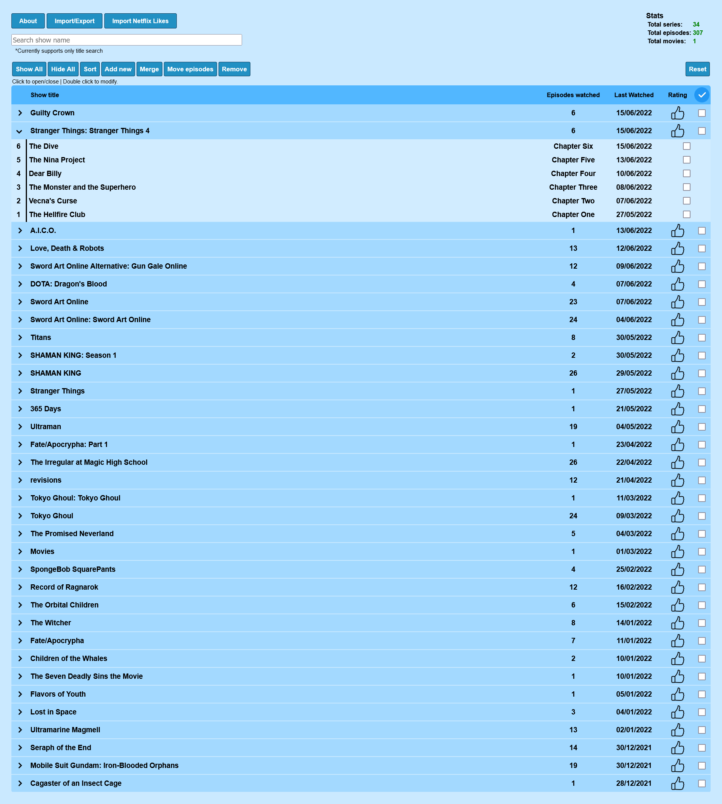

## Shows sorter
This is a little website I created to help me sort and store the shows that I watch,
- You can check out a live version of this website here http://www.watchedshows.online/

The website works in a simple way, it uses ajax request to send a file to php file, which then goes through it and returns a list, which javascript then converts into groups (show name) and episodes.

## Main features
- Importing/exporting Netflix history or custom csv files
- Importing Netflix likes (Advance user)
- Searching (currently only show name)
- It stores the list in user browser, however it is recommended to download a local file.

### Other features
- Adding, moving, deleting and meging episodes.

## Improvements
- [ ] Dates converting needs to be fixed, as currently they are hard coded to convert date to dd/mm/yyyy, which is not ideal for everyone.
